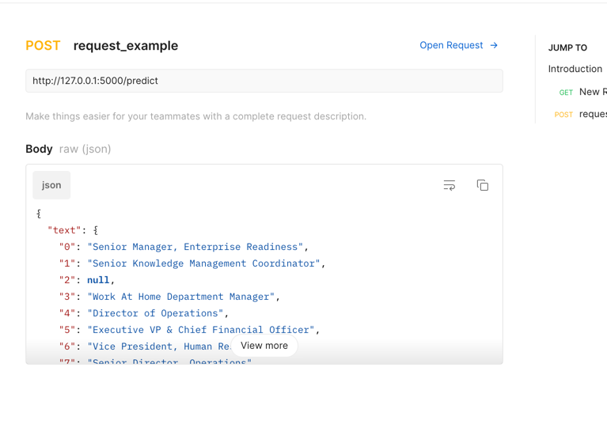
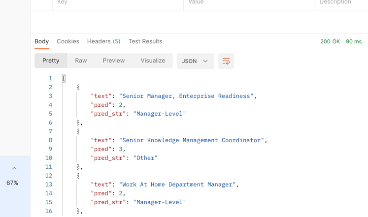

Management Level Flask app:

 **In terminal - Run pip install -r requirements.txt  - to install all the dependencies listed in the requirements.txt file.**

Make sure this is the input format (We can change if needed)

Output you should expect to get:

